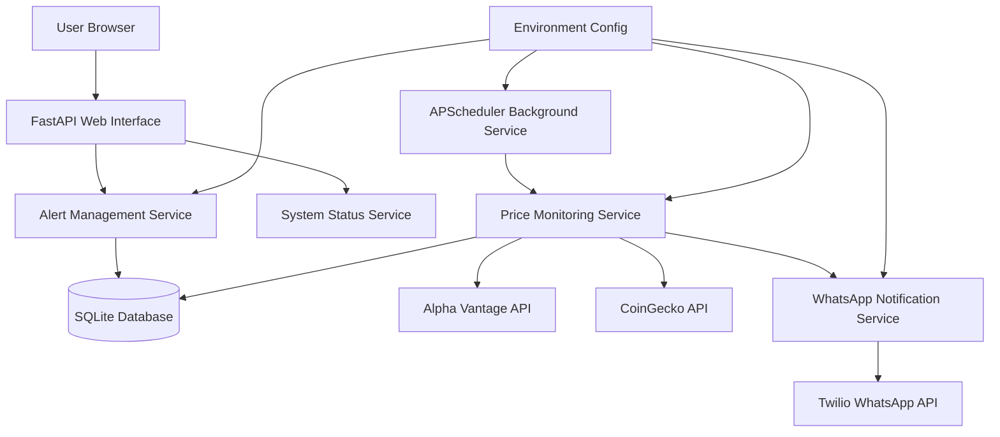
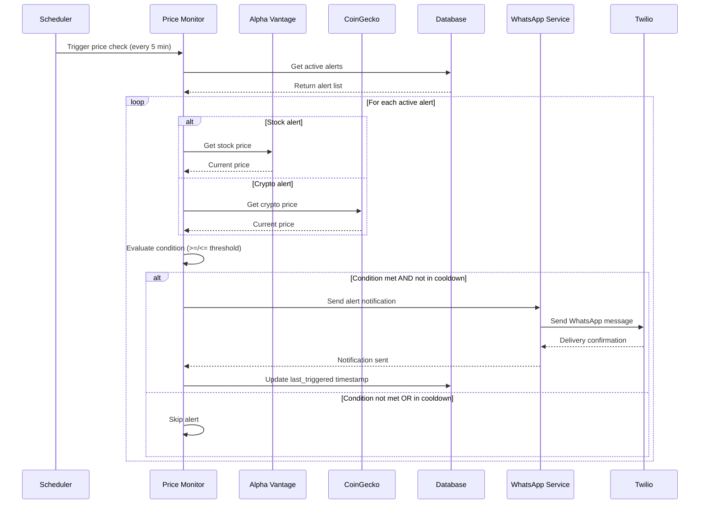
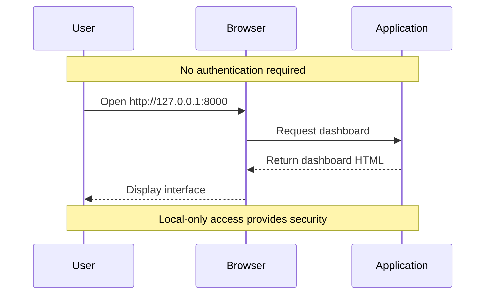
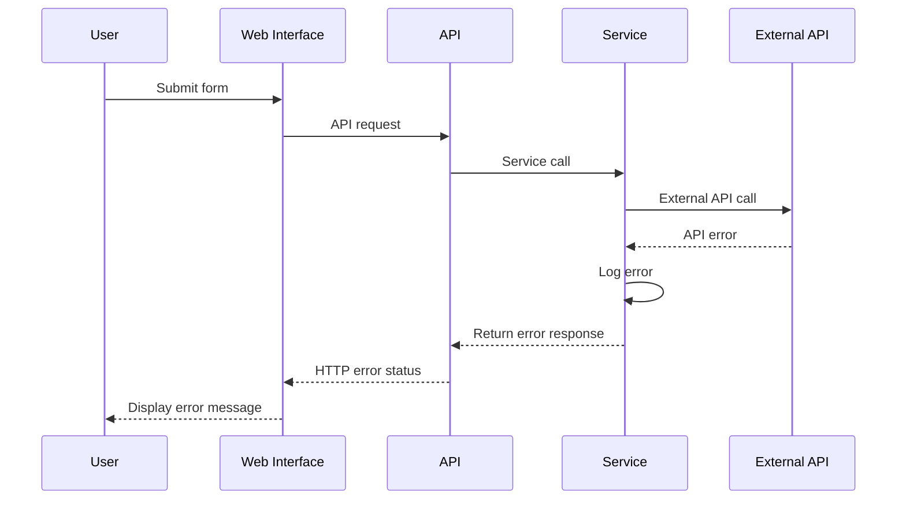

# WhatsApp Price Monitoring Application - Full-Stack Architecture Document

**Date:** 2025-08-27  
**Version:** 1.0  
**Author:** Architect Winston

## Introduction

This document outlines the complete fullstack architecture for **WhatsApp Price Monitoring Application**, including backend systems, frontend implementation, and their integration. It serves as the single source of truth for AI-driven development, ensuring consistency across the entire technology stack.

This unified approach combines what would traditionally be separate backend and frontend architecture documents, streamlining the development process for this focused personal-use application where simplicity and reliability are paramount.

### Starter Template or Existing Project

**N/A - Greenfield project**

This is a new personal-use application built from scratch. No existing starter templates or legacy systems to consider. The architecture is designed specifically for local deployment and personal productivity.

### Change Log
| Date | Version | Description | Author |
|------|---------|-------------|--------|
| 2025-08-27 | 1.0 | Initial architecture creation from PRD | Architect Winston |

## High Level Architecture

### Technical Summary

This is a **monolithic FastAPI application** with integrated web UI serving as a personal price monitoring tool. The architecture combines a Python backend with server-side rendered HTML templates, SQLite for local persistence, and background scheduling for automated price monitoring. External integrations include financial APIs (Alpha Vantage, CoinGecko) and Twilio WhatsApp for notifications. The entire system runs locally on Windows PC with no cloud dependencies, prioritizing simplicity and reliability over scalability.

### Platform and Infrastructure Choice

**Platform:** Local Windows PC Development & Production  
**Key Services:** Python Runtime, SQLite Database, Local File System  
**Deployment Host and Regions:** localhost:8000 (127.0.0.1 binding only)

**Rationale:** Local deployment eliminates external dependencies, reduces costs to zero, and maintains complete control over sensitive financial data and API keys. No cloud platform needed for personal use.

### Repository Structure

**Structure:** Monorepo (Single Python Project)  
**Monorepo Tool:** Not applicable - simple Python project structure  
**Package Organization:** Functional organization with clear separation of concerns (routes, services, models, templates)

### High Level Architecture Diagram



### Architectural Patterns

- **Monolithic Architecture:** Single-process application with integrated components - _Rationale:_ Simplifies deployment and maintenance for personal use
- **Server-Side Rendering (SSR):** Jinja2 templates for HTML generation - _Rationale:_ Minimal JavaScript complexity, better for simple CRUD interfaces
- **Repository Pattern:** Abstract data access logic through service layer - _Rationale:_ Enables testing and maintains clean separation between business logic and persistence
- **Background Job Pattern:** APScheduler for automated price monitoring - _Rationale:_ Decouples user interface from monitoring tasks
- **Configuration Pattern:** Environment-based configuration via .env - _Rationale:_ Secure API key management and easy environment-specific settings

## Tech Stack

### Technology Stack Table

| Category | Technology | Version | Purpose | Rationale |
|----------|------------|---------|---------|-----------|
| Backend Language | Python | 3.8+ | Core application runtime | Excellent ecosystem for financial APIs and web development |
| Backend Framework | FastAPI | 0.100+ | Web API and HTML serving | Modern, fast, with automatic API documentation and type hints |
| Frontend Language | HTML/JavaScript | ES6+ | Web interface | Minimal client-side complexity, server-side rendering focus |
| Frontend Framework | Jinja2 Templates | 3.1+ | Server-side HTML rendering | Simple templating, integrates well with FastAPI |
| UI Component Library | None | N/A | Minimal styling | No complex UI components needed for personal tool |
| State Management | None | N/A | Server-side state | Simple form-based interactions, no complex client state |
| Database | SQLite | 3.35+ | Local data persistence | File-based, no server needed, perfect for personal use |
| Cache | None | N/A | Simple in-memory caching | Minimal caching needs, 30-second API response cache |
| File Storage | Local File System | N/A | Configuration and logs | .env files and log storage |
| Authentication | None | N/A | Local-only access | Single user, localhost binding provides security |
| Backend Testing | pytest | 7.0+ | Unit and integration testing | Standard Python testing framework |
| Frontend Testing | Manual | N/A | UI workflow testing | Simple forms don't require automated frontend testing |
| E2E Testing | Manual | N/A | End-to-end workflow validation | Personal use allows manual testing approach |
| Build Tool | pip | Latest | Dependency management | Standard Python package management |
| Bundler | None | N/A | No bundling needed | Server-side rendering eliminates bundling complexity |
| IaC Tool | None | N/A | No infrastructure | Local deployment only |
| CI/CD | None | N/A | Manual deployment | Personal tool doesn't require automation |
| Monitoring | Python logging | Built-in | Application logging | File-based logging with rotation |
| Logging | Python logging | Built-in | Error tracking and debugging | Structured logging to files |
| CSS Framework | None | N/A | Minimal styling | Basic CSS for clean, functional interface |

## Data Models

### Alert

**Purpose:** Core entity representing a price monitoring alert with trigger conditions and status tracking.

**Key Attributes:**
- id: Integer - Primary key, auto-increment
- asset_symbol: String - Stock ticker (AAPL) or crypto symbol (bitcoin)
- asset_type: Enum - 'stock' or 'crypto' only
- condition_type: Enum - '>=' or '<=' only  
- threshold_price: Decimal - Price level that triggers alert
- is_active: Boolean - Whether alert is currently monitoring
- created_at: DateTime - When alert was created
- last_triggered: DateTime - Last time alert sent notification (for cooldown)

#### TypeScript Interface
```typescript
interface Alert {
  id: number;
  asset_symbol: string;
  asset_type: 'stock' | 'crypto';
  condition_type: '>=' | '<=';
  threshold_price: number;
  is_active: boolean;
  created_at: string; // ISO datetime
  last_triggered?: string; // ISO datetime, nullable
}
```

#### Relationships
- No foreign key relationships (single entity model)
- One-to-many relationship with trigger history (implicit via last_triggered field)

### Configuration

**Purpose:** Application configuration settings loaded from environment variables.

**Key Attributes:**
- alpha_vantage_api_key: String - API key for stock price data
- twilio_account_sid: String - Twilio account identifier
- twilio_auth_token: String - Twilio authentication token
- whatsapp_number: String - User's WhatsApp number for notifications
- monitoring_interval: Integer - Minutes between price checks (1-60)
- cooldown_hours: Integer - Hours between duplicate alerts (default 3)

#### TypeScript Interface
```typescript
interface Configuration {
  alpha_vantage_api_key: string;
  twilio_account_sid: string;
  twilio_auth_token: string;
  whatsapp_number: string;
  monitoring_interval: number; // 1-60 minutes
  cooldown_hours: number; // default 3
}
```

## API Specification

### REST API Specification

```yaml
openapi: 3.0.0
info:
  title: Price Monitoring API
  version: 1.0.0
  description: Local API for managing price alerts and system status
servers:
  - url: http://127.0.0.1:8000
    description: Local development and production server

paths:
  /:
    get:
      summary: Main dashboard page
      responses:
        '200':
          description: HTML dashboard with alert form and table
          content:
            text/html:
              schema:
                type: string

  /api/alerts:
    get:
      summary: List all alerts
      responses:
        '200':
          description: Array of all alerts
          content:
            application/json:
              schema:
                type: array
                items:
                  $ref: '#/components/schemas/Alert'
    post:
      summary: Create new alert
      requestBody:
        required: true
        content:
          application/json:
            schema:
              $ref: '#/components/schemas/CreateAlert'
      responses:
        '201':
          description: Alert created successfully
        '400':
          description: Validation error

  /api/alerts/{alert_id}/toggle:
    patch:
      summary: Toggle alert active status
      parameters:
        - name: alert_id
          in: path
          required: true
          schema:
            type: integer
      responses:
        '200':
          description: Alert status updated
        '404':
          description: Alert not found

  /api/alerts/{alert_id}:
    delete:
      summary: Delete alert
      parameters:
        - name: alert_id
          in: path
          required: true
          schema:
            type: integer
      responses:
        '204':
          description: Alert deleted
        '404':
          description: Alert not found

  /api/status:
    get:
      summary: System health status
      responses:
        '200':
          description: System status information
          content:
            application/json:
              schema:
                $ref: '#/components/schemas/SystemStatus'

components:
  schemas:
    Alert:
      type: object
      properties:
        id:
          type: integer
        asset_symbol:
          type: string
        asset_type:
          type: string
          enum: ['stock', 'crypto']
        condition_type:
          type: string
          enum: ['>=', '<=']
        threshold_price:
          type: number
        is_active:
          type: boolean
        created_at:
          type: string
          format: date-time
        last_triggered:
          type: string
          format: date-time
          nullable: true

    CreateAlert:
      type: object
      required:
        - asset_symbol
        - asset_type
        - condition_type
        - threshold_price
      properties:
        asset_symbol:
          type: string
        asset_type:
          type: string
          enum: ['stock', 'crypto']
        condition_type:
          type: string
          enum: ['>=', '<=']
        threshold_price:
          type: number

    SystemStatus:
      type: object
      properties:
        database_status:
          type: string
        api_status:
          type: object
        scheduler_status:
          type: object
        last_check_time:
          type: string
          format: date-time
```

## Components

### FastAPI Web Application

**Responsibility:** Main application entry point serving both HTML templates and JSON API endpoints for alert management and system status.

**Key Interfaces:**
- HTTP endpoints for CRUD operations on alerts
- HTML template rendering for web interface
- Health check and status endpoints

**Dependencies:** SQLAlchemy (database), Jinja2 (templates), Alert Service

**Technology Stack:** FastAPI with Jinja2 templates, uvicorn ASGI server

### Alert Management Service

**Responsibility:** Business logic for creating, updating, deleting, and querying price alerts with validation and persistence.

**Key Interfaces:**
- CRUD operations on Alert entities
- Alert validation (asset types, condition types, price validation)
- Active alert filtering for monitoring

**Dependencies:** Database Models, Configuration

**Technology Stack:** Python service classes with SQLAlchemy ORM

### Price Monitoring Service

**Responsibility:** Automated price fetching from external APIs, alert evaluation, and triggering notifications when conditions are met.

**Key Interfaces:**
- Price fetching from Alpha Vantage and CoinGecko APIs
- Alert condition evaluation against current prices
- Cooldown period management

**Dependencies:** Alert Service, WhatsApp Service, External APIs

**Technology Stack:** Python with requests library, APScheduler integration

### WhatsApp Notification Service

**Responsibility:** Send formatted WhatsApp messages through Twilio when price alerts are triggered.

**Key Interfaces:**
- Message formatting with price and alert details
- Twilio WhatsApp API integration
- Delivery confirmation and error handling

**Dependencies:** Twilio SDK, Configuration Service

**Technology Stack:** Python with Twilio SDK

### Database Service

**Responsibility:** SQLite database connection management, schema initialization, and ORM configuration.

**Key Interfaces:**
- Database connection and session management
- Automatic table creation on first run
- Transaction management for data consistency

**Dependencies:** SQLite file system

**Technology Stack:** SQLAlchemy ORM with SQLite dialect

### Configuration Service

**Responsibility:** Load and validate configuration from environment variables with secure handling of API keys.

**Key Interfaces:**
- Environment variable loading and parsing
- Configuration validation and defaults
- Secure API key management

**Dependencies:** python-dotenv, OS environment

**Technology Stack:** Python with environment variable parsing

## External APIs

### Alpha Vantage API

- **Purpose:** Real-time and historical stock price data
- **Documentation:** https://www.alphavantage.co/documentation/
- **Base URL(s):** https://www.alphavantage.co/query
- **Authentication:** API key parameter
- **Rate Limits:** 5 calls per minute (free tier)

**Key Endpoints Used:**
- `GET /query?function=GLOBAL_QUOTE&symbol={symbol}&apikey={key}` - Current stock price

**Integration Notes:** Implement exponential backoff for rate limit handling. Cache responses for 30 seconds to minimize API calls during development.

### CoinGecko API

- **Purpose:** Cryptocurrency price data and market information
- **Documentation:** https://www.coingecko.com/en/api
- **Base URL(s):** https://api.coingecko.com/api/v3
- **Authentication:** No API key required for basic tier
- **Rate Limits:** 10-50 calls/minute (generous free tier)

**Key Endpoints Used:**
- `GET /simple/price?ids={coin_id}&vs_currencies=usd` - Current crypto price

**Integration Notes:** More generous rate limits than Alpha Vantage. Use coin IDs (bitcoin, ethereum) rather than symbols.

### Twilio WhatsApp API

- **Purpose:** WhatsApp message delivery for price alert notifications
- **Documentation:** https://www.twilio.com/docs/whatsapp
- **Base URL(s):** https://api.twilio.com/2010-04-01/Accounts/{AccountSid}/Messages.json
- **Authentication:** Basic auth with Account SID and Auth Token
- **Rate Limits:** 1 message/second (sandbox), higher for production

**Key Endpoints Used:**
- `POST /Messages.json` - Send WhatsApp message

**Integration Notes:** Use Sandbox for development with pre-approved numbers. Production requires WhatsApp Cloud API migration.

## Core Workflows

### Price Alert Workflow



## Database Schema

```sql
-- Price alerts table
CREATE TABLE alerts (
    id INTEGER PRIMARY KEY AUTOINCREMENT,
    asset_symbol VARCHAR(20) NOT NULL,
    asset_type VARCHAR(10) NOT NULL CHECK (asset_type IN ('stock', 'crypto')),
    condition_type VARCHAR(2) NOT NULL CHECK (condition_type IN ('>=', '<=')),
    threshold_price DECIMAL(15, 8) NOT NULL,
    is_active BOOLEAN NOT NULL DEFAULT TRUE,
    created_at DATETIME NOT NULL DEFAULT CURRENT_TIMESTAMP,
    last_triggered DATETIME NULL
);

-- Indexes for performance
CREATE INDEX idx_alerts_active ON alerts(is_active);
CREATE INDEX idx_alerts_asset_symbol ON alerts(asset_symbol);
CREATE INDEX idx_alerts_last_triggered ON alerts(last_triggered);

-- Configuration table (optional - can use env vars only)
CREATE TABLE configuration (
    key VARCHAR(50) PRIMARY KEY,
    value TEXT NOT NULL,
    updated_at DATETIME NOT NULL DEFAULT CURRENT_TIMESTAMP
);
```

## Frontend Architecture

### Component Architecture

#### Component Organization
```
templates/
├── base.html              # Base template with common HTML structure
├── dashboard.html         # Main dashboard with alert form and table
├── status.html           # System status page
└── partials/
    ├── alert_form.html    # Alert creation form component
    ├── alert_table.html   # Alert management table component
    └── status_cards.html  # System status cards component

static/
├── css/
│   └── styles.css        # Minimal CSS for clean interface
└── js/
    └── dashboard.js      # Basic JavaScript for form interactions
```

#### Component Template
```html
<!-- Base template structure -->
<!DOCTYPE html>
<html lang="en">
<head>
    <meta charset="UTF-8">
    <meta name="viewport" content="width=device-width, initial-scale=1.0">
    <title>Price Monitor</title>
    <link rel="stylesheet" href="{{ url_for('static', path='/css/styles.css') }}">
</head>
<body>
    <header>
        <h1>Price Monitor</h1>
        <nav>
            <a href="/">Dashboard</a>
            <a href="/status">Status</a>
        </nav>
    </header>
    <main>
        
    </main>
    <script src="{{ url_for('static', path='/js/dashboard.js') }}"></script>
</body>
</html>
```

### State Management Architecture

#### State Structure
```typescript
// No complex client-side state - server-side state management
interface PageState {
  alerts: Alert[];
  systemStatus: SystemStatus;
  formData: Partial<CreateAlert>;
  notifications: {
    success?: string;
    error?: string;
  };
}
```

#### State Management Patterns
- Server-side state with page reloads for data updates
- Form state managed through HTML form elements
- Flash messages for user feedback after form submissions
- No client-side state persistence needed

### Routing Architecture

#### Route Organization
```
Routes:
/                    # Main dashboard (GET)
/alerts              # Alert management (POST for creation)
/alerts/{id}/toggle  # Toggle alert status (POST)
/alerts/{id}/delete  # Delete alert (POST)
/status             # System status page (GET)
/api/alerts         # JSON API endpoints (GET, POST)
/api/status         # JSON system status (GET)
```

#### Protected Route Pattern
```python
# No authentication needed - localhost binding provides security
# All routes accessible without protection for single-user personal use
@app.get("/")
async def dashboard(request: Request):
    return templates.TemplateResponse("dashboard.html", {"request": request})
```

### Frontend Services Layer

#### API Client Setup
```typescript
// Simple fetch-based API client for AJAX requests
class ApiClient {
  private baseURL = 'http://127.0.0.1:8000/api';
  
  async createAlert(alert: CreateAlert): Promise<Alert> {
    const response = await fetch(`${this.baseURL}/alerts`, {
      method: 'POST',
      headers: { 'Content-Type': 'application/json' },
      body: JSON.stringify(alert)
    });
    return response.json();
  }
  
  async toggleAlert(id: number): Promise<void> {
    await fetch(`${this.baseURL}/alerts/${id}/toggle`, {
      method: 'PATCH'
    });
  }
}
```

#### Service Example
```typescript
// Alert management service
class AlertService {
  constructor(private apiClient: ApiClient) {}
  
  async createAlert(formData: FormData): Promise<void> {
    const alert: CreateAlert = {
      asset_symbol: formData.get('asset_symbol') as string,
      asset_type: formData.get('asset_type') as 'stock' | 'crypto',
      condition_type: formData.get('condition_type') as '>=' | '<=',
      threshold_price: parseFloat(formData.get('threshold_price') as string)
    };
    
    await this.apiClient.createAlert(alert);
    location.reload(); // Simple page reload for state update
  }
}
```

## Backend Architecture

### Service Architecture

#### Controller/Route Organization
```
src/
├── main.py                # FastAPI application entry point
├── routes/
│   ├── __init__.py
│   ├── web.py            # HTML template routes
│   └── api.py            # JSON API routes
├── services/
│   ├── __init__.py
│   ├── alert_service.py  # Alert business logic
│   ├── price_service.py  # Price monitoring logic
│   └── whatsapp_service.py # Notification logic
├── models/
│   ├── __init__.py
│   └── alert.py         # SQLAlchemy models
├── config/
│   ├── __init__.py
│   └── settings.py      # Configuration management
└── utils/
    ├── __init__.py
    ├── database.py      # Database connection
    └── scheduler.py     # APScheduler setup
```

#### Controller Template
```python
from fastapi import FastAPI, Request, Form, HTTPException
from fastapi.templating import Jinja2Templates
from fastapi.staticfiles import StaticFiles
from services.alert_service import AlertService

app = FastAPI()
app.mount("/static", StaticFiles(directory="static"), name="static")
templates = Jinja2Templates(directory="templates")

@app.get("/")
async def dashboard(request: Request):
    alerts = await AlertService.get_all_alerts()
    return templates.TemplateResponse("dashboard.html", {
        "request": request,
        "alerts": alerts
    })

@app.post("/alerts")
async def create_alert(
    asset_symbol: str = Form(...),
    asset_type: str = Form(...),
    condition_type: str = Form(...),
    threshold_price: float = Form(...)
):
    alert_data = {
        "asset_symbol": asset_symbol,
        "asset_type": asset_type,
        "condition_type": condition_type,
        "threshold_price": threshold_price
    }
    await AlertService.create_alert(alert_data)
    return RedirectResponse(url="/", status_code=303)
```

### Database Architecture

#### Schema Design
```sql
-- Complete schema as defined earlier
CREATE TABLE alerts (
    id INTEGER PRIMARY KEY AUTOINCREMENT,
    asset_symbol VARCHAR(20) NOT NULL,
    asset_type VARCHAR(10) NOT NULL CHECK (asset_type IN ('stock', 'crypto')),
    condition_type VARCHAR(2) NOT NULL CHECK (condition_type IN ('>=', '<=')),
    threshold_price DECIMAL(15, 8) NOT NULL,
    is_active BOOLEAN NOT NULL DEFAULT TRUE,
    created_at DATETIME NOT NULL DEFAULT CURRENT_TIMESTAMP,
    last_triggered DATETIME NULL
);
```

#### Data Access Layer
```python
from sqlalchemy.orm import Session
from models.alert import Alert as AlertModel
from typing import List, Optional

class AlertRepository:
    def __init__(self, db: Session):
        self.db = db
    
    async def create_alert(self, alert_data: dict) -> AlertModel:
        alert = AlertModel(**alert_data)
        self.db.add(alert)
        self.db.commit()
        self.db.refresh(alert)
        return alert
    
    async def get_active_alerts(self) -> List[AlertModel]:
        return self.db.query(AlertModel).filter(AlertModel.is_active == True).all()
    
    async def update_last_triggered(self, alert_id: int, timestamp: datetime):
        alert = self.db.query(AlertModel).filter(AlertModel.id == alert_id).first()
        if alert:
            alert.last_triggered = timestamp
            self.db.commit()
```

### Authentication and Authorization

#### Auth Flow


#### Middleware/Guards
```python
# No authentication middleware needed
# Security provided by localhost binding (127.0.0.1)
from fastapi import FastAPI

app = FastAPI()

# Bind only to localhost for security
if __name__ == "__main__":
    import uvicorn
    uvicorn.run(app, host="127.0.0.1", port=8000)
```

## Unified Project Structure

```
price-monitor/
├── README.md                   # Setup and usage instructions
├── requirements.txt           # Python dependencies
├── .env.example              # Environment variables template
├── .gitignore                # Git ignore file
├── main.py                   # Application entry point
├── src/
│   ├── __init__.py
│   ├── routes/
│   │   ├── __init__.py
│   │   ├── web.py           # HTML routes
│   │   └── api.py           # JSON API routes
│   ├── services/
│   │   ├── __init__.py
│   │   ├── alert_service.py # Alert business logic
│   │   ├── price_service.py # Price monitoring
│   │   └── whatsapp_service.py # Notifications
│   ├── models/
│   │   ├── __init__.py
│   │   └── alert.py        # SQLAlchemy models
│   ├── config/
│   │   ├── __init__.py
│   │   └── settings.py     # Configuration
│   └── utils/
│       ├── __init__.py
│       ├── database.py     # DB connection
│       └── scheduler.py    # Background jobs
├── templates/
│   ├── base.html           # Base template
│   ├── dashboard.html      # Main interface
│   └── status.html         # System status
├── static/
│   ├── css/
│   │   └── styles.css      # Basic styling
│   └── js/
│       └── dashboard.js    # Simple interactions
├── tests/
│   ├── __init__.py
│   ├── test_alerts.py      # Alert logic tests
│   ├── test_price_service.py # Price monitoring tests
│   └── test_api.py         # API endpoint tests
├── data/
│   └── alerts.db           # SQLite database (created at runtime)
├── logs/
│   └── app.log             # Application logs (created at runtime)
└── scripts/
    ├── start_windows.bat   # Windows startup script
    └── setup.py           # Initial setup script
```

## Development Workflow

### Local Development Setup

#### Prerequisites
```bash
# Python 3.8 or higher
python --version

# pip for package management
pip --version
```

#### Initial Setup
```bash
# Clone or create project directory
mkdir price-monitor
cd price-monitor

# Create virtual environment
python -m venv venv

# Activate virtual environment (Windows)
venv\Scripts\activate

# Install dependencies
pip install -r requirements.txt

# Copy environment template
copy .env.example .env

# Edit .env with your API keys
# ALPHA_VANTAGE_API_KEY=your_key_here
# TWILIO_ACCOUNT_SID=your_sid_here
# TWILIO_AUTH_TOKEN=your_token_here
# WHATSAPP_NUMBER=your_number_here
```

#### Development Commands
```bash
# Start application
python main.py

# Start with auto-reload for development
uvicorn main:app --host 127.0.0.1 --port 8000 --reload

# Run tests
pytest tests/

# Run with verbose logging
python main.py --log-level DEBUG
```

### Environment Configuration

#### Required Environment Variables
```bash
# API Keys
ALPHA_VANTAGE_API_KEY=your_alpha_vantage_key
TWILIO_ACCOUNT_SID=your_twilio_sid
TWILIO_AUTH_TOKEN=your_twilio_token

# WhatsApp Configuration
WHATSAPP_NUMBER=+1234567890

# Application Settings
MONITORING_INTERVAL_MINUTES=5
COOLDOWN_HOURS=3
LOG_LEVEL=INFO
DATABASE_PATH=data/alerts.db
```

## Deployment Architecture

### Deployment Strategy

**Frontend Deployment:**
- **Platform:** Local Windows PC (no separate frontend deployment)
- **Build Command:** Not applicable (server-side rendering)
- **Output Directory:** Templates served directly by FastAPI
- **CDN/Edge:** Not applicable (local access only)

**Backend Deployment:**
- **Platform:** Local Windows PC
- **Build Command:** pip install -r requirements.txt
- **Deployment Method:** Direct Python execution or Windows service

### Environments

| Environment | Frontend URL | Backend URL | Purpose |
|-------------|-------------|-------------|---------|
| Development | http://127.0.0.1:8000 | http://127.0.0.1:8000/api | Local development |
| Production | http://127.0.0.1:8000 | http://127.0.0.1:8000/api | Personal use (same as dev) |

## Security and Performance

### Security Requirements

**Frontend Security:**
- CSP Headers: Not required for localhost-only access
- XSS Prevention: Jinja2 template escaping enabled by default
- Secure Storage: No sensitive data stored in browser

**Backend Security:**
- Input Validation: Pydantic models for request validation
- Rate Limiting: Not required for personal single-user access
- CORS Policy: Restrictive - localhost only

**Authentication Security:**
- Token Storage: Not applicable (no authentication)
- Session Management: Not applicable (no sessions)
- Password Policy: Not applicable (no user accounts)

### Performance Optimization

**Frontend Performance:**
- Bundle Size Target: Not applicable (no bundling)
- Loading Strategy: Server-side rendering for fast initial load
- Caching Strategy: Browser caching of static CSS/JS files

**Backend Performance:**
- Response Time Target: <200ms for local requests
- Database Optimization: SQLite indexes on frequently queried fields
- Caching Strategy: 30-second in-memory cache for API responses

## Testing Strategy

### Testing Pyramid
```
        E2E Tests (Manual)
       /                \
    Integration Tests (pytest)
   /                        \
Unit Tests (pytest)    API Tests (pytest)
```

### Test Organization

#### Backend Tests
```
tests/
├── unit/
│   ├── test_alert_service.py    # Alert business logic
│   ├── test_price_service.py    # Price monitoring logic
│   └── test_whatsapp_service.py # Notification logic
├── integration/
│   ├── test_database.py         # Database operations
│   └── test_external_apis.py    # API integrations (mocked)
└── api/
    ├── test_web_routes.py       # HTML endpoints
    └── test_api_routes.py       # JSON endpoints
```

### Test Examples

#### Backend API Test
```python
import pytest
from fastapi.testclient import TestClient
from main import app

client = TestClient(app)

def test_create_alert():
    alert_data = {
        "asset_symbol": "AAPL",
        "asset_type": "stock", 
        "condition_type": ">=",
        "threshold_price": 150.0
    }
    response = client.post("/api/alerts", json=alert_data)
    assert response.status_code == 201
    assert response.json()["asset_symbol"] == "AAPL"

def test_get_alerts():
    response = client.get("/api/alerts")
    assert response.status_code == 200
    assert isinstance(response.json(), list)
```

## Coding Standards

### Critical Full-Stack Rules

- **Environment Configuration:** Always access config through settings module, never os.environ directly
- **Error Handling:** All API routes must use try-catch blocks and return proper HTTP status codes  
- **Database Operations:** Never use raw SQL - always use SQLAlchemy ORM for type safety
- **API Response Format:** Consistent JSON response structure for all API endpoints
- **Input Validation:** Use Pydantic models for all API request validation
- **Logging:** Use structured logging with appropriate levels (DEBUG, INFO, WARNING, ERROR)

### Naming Conventions

| Element | Frontend | Backend | Example |
|---------|----------|---------|---------|
| Templates | snake_case | - | `alert_form.html` |
| CSS Classes | kebab-case | - | `.alert-table` |
| API Routes | - | kebab-case | `/api/price-alerts` |
| Database Tables | - | snake_case | `price_alerts` |
| Python Functions | - | snake_case | `create_alert()` |
| Python Classes | - | PascalCase | `AlertService` |

## Error Handling Strategy

### Error Flow


### Error Response Format
```typescript
interface ApiError {
  error: {
    code: string;
    message: string;
    details?: Record<string, any>;
    timestamp: string;
    requestId: string;
  };
}
```

### Frontend Error Handling
```python
# Template-based error display
@app.exception_handler(HTTPException)
async def http_exception_handler(request: Request, exc: HTTPException):
    return templates.TemplateResponse(
        "error.html",
        {
            "request": request,
            "error_message": exc.detail,
            "status_code": exc.status_code
        },
        status_code=exc.status_code
    )
```

### Backend Error Handling
```python
import logging
from fastapi import HTTPException

logger = logging.getLogger(__name__)

class AlertService:
    async def create_alert(self, alert_data: dict):
        try:
            # Alert creation logic
            pass
        except ValueError as e:
            logger.error(f"Validation error creating alert: {e}")
            raise HTTPException(status_code=400, detail=str(e))
        except Exception as e:
            logger.error(f"Unexpected error creating alert: {e}")
            raise HTTPException(status_code=500, detail="Internal server error")
```

## Monitoring and Observability

### Monitoring Stack
- **Frontend Monitoring:** Basic browser console error logging
- **Backend Monitoring:** Python logging to rotating files
- **Error Tracking:** File-based error logs with stack traces
- **Performance Monitoring:** Basic response time logging

### Key Metrics

**Frontend Metrics:**
- Page load times (manual observation)
- Form submission success rates
- JavaScript errors (console logs)
- User interaction patterns (manual observation)

**Backend Metrics:**
- Request rate and response times
- External API call success/failure rates  
- Alert trigger frequency and success rates
- Database query performance (SQLite query logs)

---

*This architecture document provides comprehensive guidance for developing the WhatsApp Price Monitoring Application with a focus on simplicity, reliability, and personal use requirements.*