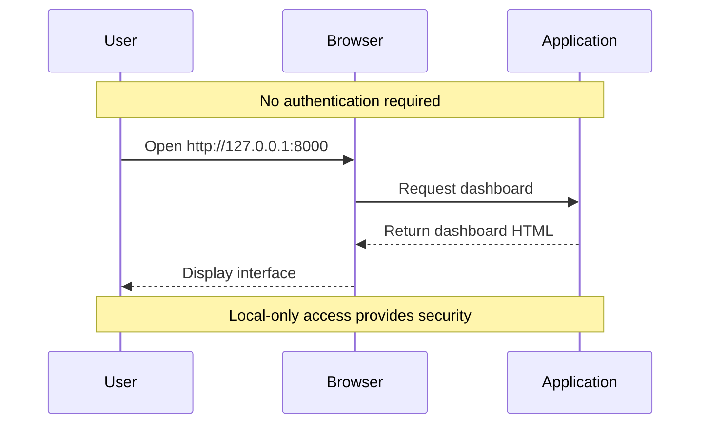

# Backend Architecture

## Service Architecture

### Controller/Route Organization
```
src/
├── main.py                # FastAPI application entry point
├── routes/
│   ├── __init__.py
│   ├── web.py            # HTML template routes
│   └── api.py            # JSON API routes
├── services/
│   ├── __init__.py
│   ├── alert_service.py  # Alert business logic
│   ├── price_service.py  # Price monitoring logic
│   └── whatsapp_service.py # Notification logic
├── models/
│   ├── __init__.py
│   └── alert.py         # SQLAlchemy models
├── config/
│   ├── __init__.py
│   └── settings.py      # Configuration management
└── utils/
    ├── __init__.py
    ├── database.py      # Database connection
    └── scheduler.py     # APScheduler setup
```

### Controller Template
```python
from fastapi import FastAPI, Request, Form, HTTPException
from fastapi.templating import Jinja2Templates
from fastapi.staticfiles import StaticFiles
from services.alert_service import AlertService

app = FastAPI()
app.mount("/static", StaticFiles(directory="static"), name="static")
templates = Jinja2Templates(directory="templates")

@app.get("/")
async def dashboard(request: Request):
    alerts = await AlertService.get_all_alerts()
    return templates.TemplateResponse("dashboard.html", {
        "request": request,
        "alerts": alerts
    })

@app.post("/alerts")
async def create_alert(
    asset_symbol: str = Form(...),
    asset_type: str = Form(...),
    condition_type: str = Form(...),
    threshold_price: float = Form(...)
):
    alert_data = {
        "asset_symbol": asset_symbol,
        "asset_type": asset_type,
        "condition_type": condition_type,
        "threshold_price": threshold_price
    }
    await AlertService.create_alert(alert_data)
    return RedirectResponse(url="/", status_code=303)
```

## Database Architecture

### Schema Design
```sql
-- Complete schema as defined earlier
CREATE TABLE alerts (
    id INTEGER PRIMARY KEY AUTOINCREMENT,
    asset_symbol VARCHAR(20) NOT NULL,
    asset_type VARCHAR(10) NOT NULL CHECK (asset_type IN ('stock', 'crypto')),
    condition_type VARCHAR(2) NOT NULL CHECK (condition_type IN ('>=', '<=')),
    threshold_price DECIMAL(15, 8) NOT NULL,
    is_active BOOLEAN NOT NULL DEFAULT TRUE,
    created_at DATETIME NOT NULL DEFAULT CURRENT_TIMESTAMP,
    last_triggered DATETIME NULL
);
```

### Data Access Layer
```python
from sqlalchemy.orm import Session
from models.alert import Alert as AlertModel
from typing import List, Optional

class AlertRepository:
    def __init__(self, db: Session):
        self.db = db
    
    async def create_alert(self, alert_data: dict) -> AlertModel:
        alert = AlertModel(**alert_data)
        self.db.add(alert)
        self.db.commit()
        self.db.refresh(alert)
        return alert
    
    async def get_active_alerts(self) -> List[AlertModel]:
        return self.db.query(AlertModel).filter(AlertModel.is_active == True).all()
    
    async def update_last_triggered(self, alert_id: int, timestamp: datetime):
        alert = self.db.query(AlertModel).filter(AlertModel.id == alert_id).first()
        if alert:
            alert.last_triggered = timestamp
            self.db.commit()
```

## Authentication and Authorization

### Auth Flow


### Middleware/Guards
```python
# No authentication middleware needed
# Security provided by localhost binding (127.0.0.1)
from fastapi import FastAPI

app = FastAPI()

# Bind only to localhost for security
if __name__ == "__main__":
    import uvicorn
    uvicorn.run(app, host="127.0.0.1", port=8000)
```
