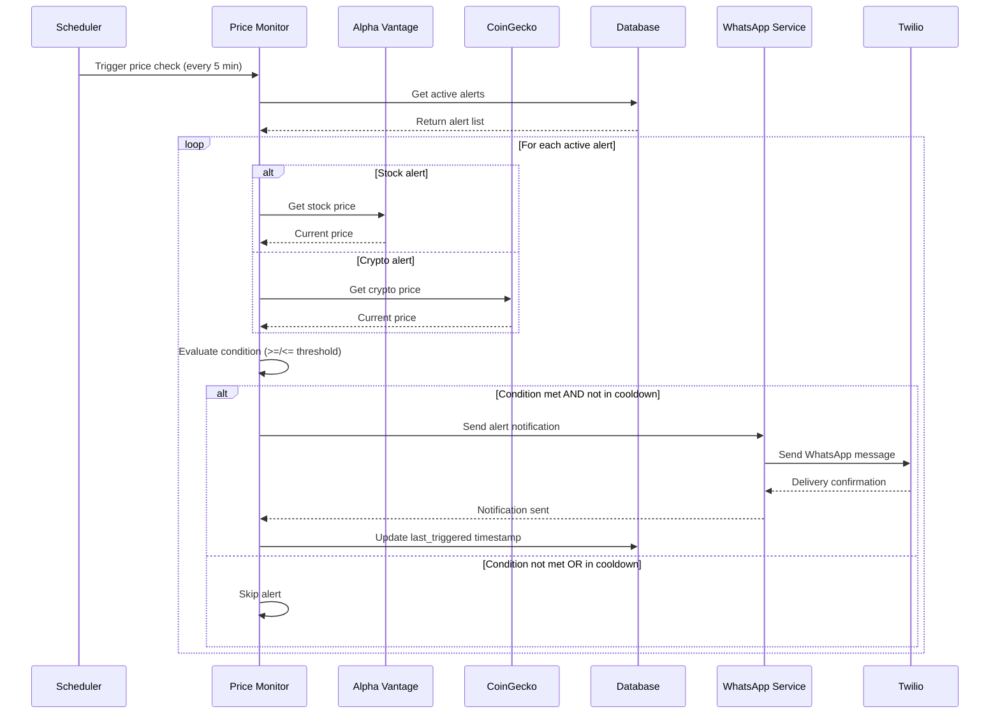

# Core Workflows

## Price Alert Workflow

```mermaid
sequenceDiagram
    participant S as Scheduler
    participant PM as Price Monitor
    participant AV as Alpha Vantage
    participant CG as CoinGecko
    participant DB as Database
    participant WA as WhatsApp Service
    participant T as Twilio

    S->>PM: Trigger price check (every 5 min)
    PM->>DB: Get active alerts
    DB-->>PM: Return alert list
    
    loop For each active alert
        alt Stock alert
            PM->>AV: Get stock price
            AV-->>PM: Current price
        else Crypto alert
            PM->>CG: Get crypto price
            CG-->>PM: Current price
        end
        
        PM->>PM: Evaluate condition (>=/<= threshold)
        
        alt Condition met AND not in cooldown
            PM->>WA: Send alert notification
            WA->>T: Send WhatsApp message
            T-->>WA: Delivery confirmation
            WA-->>PM: Notification sent
            PM->>DB: Update last_triggered timestamp
        else Condition not met OR in cooldown
            PM->>PM: Skip alert
        end
    end
```
