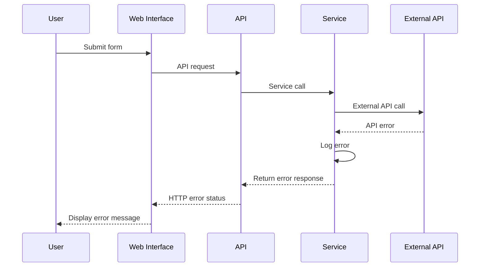

# Error Handling Strategy

## Error Flow


## Error Response Format
```typescript
interface ApiError {
  error: {
    code: string;
    message: string;
    details?: Record<string, any>;
    timestamp: string;
    requestId: string;
  };
}
```

## Frontend Error Handling
```python
# Template-based error display
@app.exception_handler(HTTPException)
async def http_exception_handler(request: Request, exc: HTTPException):
    return templates.TemplateResponse(
        "error.html",
        {
            "request": request,
            "error_message": exc.detail,
            "status_code": exc.status_code
        },
        status_code=exc.status_code
    )
```

## Backend Error Handling
```python
import logging
from fastapi import HTTPException

logger = logging.getLogger(__name__)

class AlertService:
    async def create_alert(self, alert_data: dict):
        try:
            # Alert creation logic
            pass
        except ValueError as e:
            logger.error(f"Validation error creating alert: {e}")
            raise HTTPException(status_code=400, detail=str(e))
        except Exception as e:
            logger.error(f"Unexpected error creating alert: {e}")
            raise HTTPException(status_code=500, detail="Internal server error")
```
