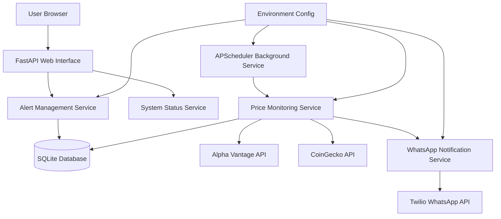

# High Level Architecture

## Technical Summary

This is a **monolithic FastAPI application** with integrated web UI serving as a personal price monitoring tool. The architecture combines a Python backend with server-side rendered HTML templates, SQLite for local persistence, and background scheduling for automated price monitoring. External integrations include financial APIs (Alpha Vantage, CoinGecko) and Twilio WhatsApp for notifications. The entire system runs locally on Windows PC with no cloud dependencies, prioritizing simplicity and reliability over scalability.

## Platform and Infrastructure Choice

**Platform:** Local Windows PC Development & Production  
**Key Services:** Python Runtime, SQLite Database, Local File System  
**Deployment Host and Regions:** localhost:8000 (127.0.0.1 binding only)

**Rationale:** Local deployment eliminates external dependencies, reduces costs to zero, and maintains complete control over sensitive financial data and API keys. No cloud platform needed for personal use.

## Repository Structure

**Structure:** Monorepo (Single Python Project)  
**Monorepo Tool:** Not applicable - simple Python project structure  
**Package Organization:** Functional organization with clear separation of concerns (routes, services, models, templates)

## High Level Architecture Diagram

## Architectural Patterns

- **Monolithic Architecture:** Single-process application with integrated components - _Rationale:_ Simplifies deployment and maintenance for personal use
- **Server-Side Rendering (SSR):** Jinja2 templates for HTML generation - _Rationale:_ Minimal JavaScript complexity, better for simple CRUD interfaces
- **Repository Pattern:** Abstract data access logic through service layer - _Rationale:_ Enables testing and maintains clean separation between business logic and persistence
- **Background Job Pattern:** APScheduler for automated price monitoring - _Rationale:_ Decouples user interface from monitoring tasks
- **Configuration Pattern:** Environment-based configuration via .env - _Rationale:_ Secure API key management and easy environment-specific settings
