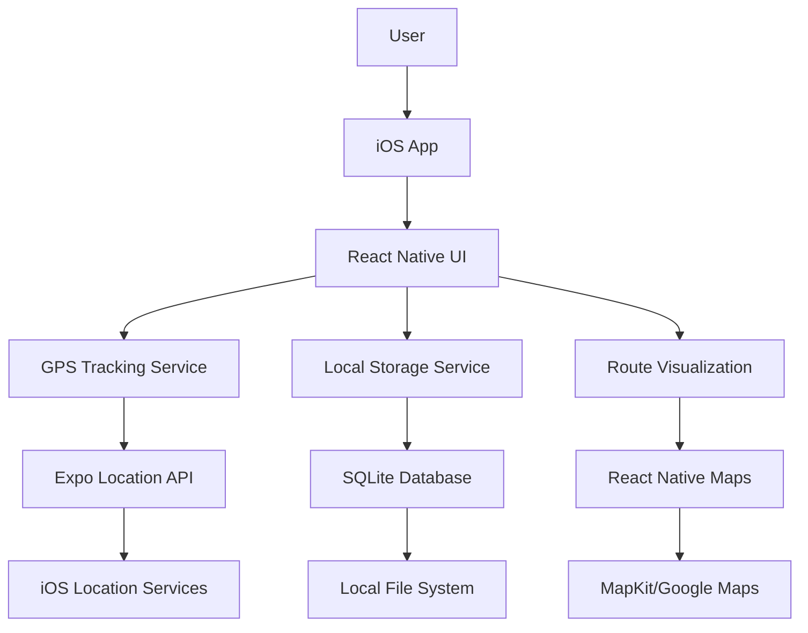
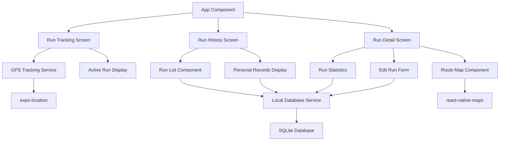
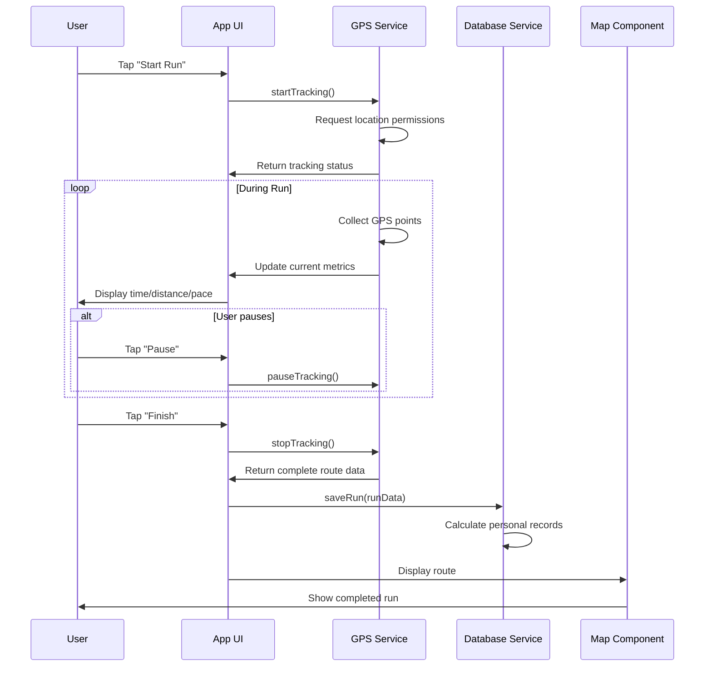
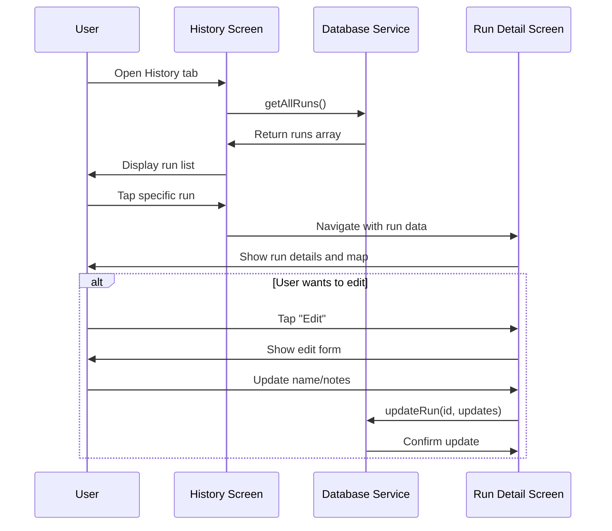
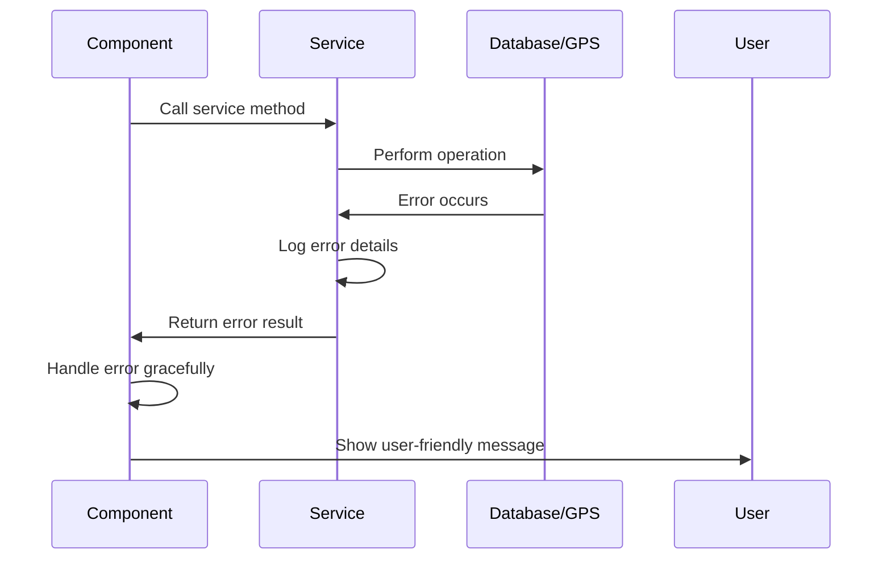

# Personal Running Tracker MVP Fullstack Architecture Document

## Introduction

This document outlines the complete fullstack architecture for Personal Running Tracker MVP, including mobile application systems, local data storage, and their integration. It serves as the single source of truth for AI-driven development, ensuring consistency across the entire technology stack.

This unified approach combines what would traditionally be separate mobile and data architecture documents, streamlining the development process for modern local-first applications where these concerns are increasingly intertwined.

### Starter Template or Existing Project

**Template:** Expo managed workflow with TypeScript starter
- Using Expo CLI `npx create-expo-app --template` with TypeScript
- Pre-configured with React Native, TypeScript, and Expo SDK
- Standard navigation and state management patterns
- No additional constraints beyond Expo managed workflow limitations

### Change Log

| Date | Version | Description | Author |
|------|---------|-------------|---------|
| 2025-09-18 | 1.0 | Initial architecture creation from Project Brief | Winston (Architect) |

## High Level Architecture

### Technical Summary

Personal Running Tracker uses a **local-first mobile architecture** built on Expo managed workflow with React Native and TypeScript. The app employs **SQLite for local data persistence**, **Expo Location for GPS tracking**, and **React Native Maps for route visualization**. All data remains on-device with no backend services or cloud dependencies. The architecture prioritizes **simplicity, privacy, and offline functionality** through a streamlined component structure that delivers core running tracking features without external integrations.

### Platform and Infrastructure Choice

**Platform:** Local iOS Device (No Cloud Infrastructure)
**Key Services:**
- Expo managed workflow for development and deployment
- iOS Location Services for GPS tracking
- Local SQLite database for data persistence
- Apple App Store for distribution

**Deployment Host and Regions:** Local device only - no remote hosting required

### Repository Structure

**Structure:** Single repository (Monorepo not needed for single mobile app)
**Monorepo Tool:** N/A - Single Expo project structure
**Package Organization:** Standard Expo project with clean component organization by feature/screen

### High Level Architecture Diagram



### Architectural Patterns

- **Local-First Architecture:** All data stored and processed locally on device - _Rationale:_ Privacy-first approach eliminates cloud dependencies and ensures data ownership
- **Component-Based UI:** Reusable React Native components with TypeScript - _Rationale:_ Maintainability and type safety for mobile development
- **Service Layer Pattern:** Abstracted data access and GPS tracking logic - _Rationale:_ Separation of concerns and testability
- **Event-Driven State Management:** React hooks and context for state management - _Rationale:_ Simple state management appropriate for single-user local app
- **Repository Pattern:** Abstract SQLite database operations - _Rationale:_ Enables testing and potential future database changes

## Tech Stack

### Technology Stack Table

| Category | Technology | Version | Purpose | Rationale |
|----------|------------|---------|---------|-----------|
| Frontend Language | TypeScript | 5.0+ | Type-safe mobile development | Better developer experience and fewer runtime errors |
| Frontend Framework | React Native | 0.72+ | Mobile app framework | Expo compatibility and mature ecosystem |
| Mobile SDK | Expo SDK | 49+ | Development and deployment | Rapid development with managed workflow |
| UI Component Library | React Native Elements | 3.4+ | Pre-built UI components | Consistent iOS design patterns |
| State Management | React Context + Hooks | Built-in | Local state management | Simple state needs don't require Redux |
| Database | SQLite | 3.40+ | Local data persistence | Lightweight, serverless, perfect for mobile |
| SQLite Library | expo-sqlite | 11.0+ | React Native SQLite interface | Official Expo SQLite implementation |
| GPS/Location | expo-location | 16.0+ | GPS tracking and location services | Official Expo location API |
| Maps | react-native-maps | 1.7+ | Route visualization | Mature mapping library for React Native |
| Navigation | React Navigation | 6.0+ | Screen navigation | Standard React Native navigation |
| Frontend Testing | Jest + React Native Testing Library | Latest | Component and logic testing | Standard React Native testing stack |
| E2E Testing | Detox | 20.0+ | End-to-end mobile testing | React Native focused E2E testing |
| Build Tool | Expo CLI | 6.0+ | Build and development | Integrated Expo build system |
| Code Quality | ESLint + Prettier | Latest | Code formatting and linting | Standard TypeScript/React Native setup |
| CI/CD | GitHub Actions | N/A | Automated testing and builds | Free CI/CD for public repositories |
| Monitoring | Expo Application Services | N/A | Crash reporting and analytics | Basic monitoring for development |

## Data Models

### Run Model

**Purpose:** Core entity representing a single running session with GPS tracking data, metrics, and metadata

**Key Attributes:**
- id: string (UUID) - Unique identifier for the run
- startTime: Date - When the run began
- endTime: Date - When the run finished
- duration: number - Total run time in seconds
- distance: number - Total distance in meters
- averagePace: number - Average pace in seconds per kilometer
- route: GPSPoint[] - Array of GPS coordinates
- name: string - User-defined name for the run
- notes: string - Optional notes about the run
- createdAt: Date - Record creation timestamp

#### TypeScript Interface

```typescript
interface Run {
  id: string;
  startTime: Date;
  endTime: Date;
  duration: number; // seconds
  distance: number; // meters
  averagePace: number; // seconds per km
  route: GPSPoint[];
  name: string;
  notes?: string;
  createdAt: Date;
}

interface GPSPoint {
  latitude: number;
  longitude: number;
  altitude?: number;
  timestamp: Date;
  accuracy?: number;
}
```

#### Relationships
- Has many GPSPoints (embedded within route array)
- Aggregated into PersonalRecords calculations

### PersonalRecord Model

**Purpose:** Tracks personal best performances for different distances

**Key Attributes:**
- distance: number - Distance in meters (e.g., 5000 for 5K)
- bestTime: number - Best time in seconds for this distance
- runId: string - Reference to the run that achieved this record
- achievedAt: Date - When this record was set

#### TypeScript Interface

```typescript
interface PersonalRecord {
  distance: number; // meters
  bestTime: number; // seconds
  runId: string;
  achievedAt: Date;
}
```

#### Relationships
- References Run entity via runId
- Calculated/updated when new runs are completed

## API Specification

**No API Required** - This is a local-first application with no backend services. All data operations are performed directly against the local SQLite database using the expo-sqlite library. GPS data is obtained directly from device location services via expo-location.

## Components

### GPS Tracking Service

**Responsibility:** Manages real-time GPS location tracking during runs, handling location permissions, tracking state, and coordinate collection

**Key Interfaces:**
- `startTracking()` - Begin GPS tracking with proper permissions
- `stopTracking()` - End GPS tracking and return route data
- `pauseTracking()` - Temporarily pause location collection
- `getCurrentLocation()` - Get single location point

**Dependencies:** expo-location, device location services

**Technology Stack:** expo-location 16.0+, React hooks for state management

### Local Database Service

**Responsibility:** Manages all SQLite database operations including schema creation, run data persistence, and personal records calculation

**Key Interfaces:**
- `saveRun(run: Run)` - Persist completed run data
- `getAllRuns()` - Retrieve run history sorted by date
- `getPersonalRecords()` - Calculate and return current PRs
- `updateRun(id: string, updates: Partial<Run>)` - Edit run details

**Dependencies:** expo-sqlite

**Technology Stack:** expo-sqlite 11.0+, TypeScript interfaces for type safety

### Route Visualization Component

**Responsibility:** Displays completed run routes on interactive maps with route polylines and performance metrics overlay

**Key Interfaces:**
- `<RouteMap route={GPSPoint[]} />` - Display route on map
- `<RunSummary run={Run} />` - Show run statistics
- Route zoom and pan controls

**Dependencies:** react-native-maps, GPS data from tracking service

**Technology Stack:** react-native-maps 1.7+, React Native components

### Run History Manager

**Responsibility:** Manages display of historical runs, personal records, and run editing functionality

**Key Interfaces:**
- `<RunList runs={Run[]} />` - Display run history list
- `<RunDetail run={Run} />` - Show individual run details
- `<EditRun run={Run} />` - Edit run metadata

**Dependencies:** Local Database Service

**Technology Stack:** React Native components, React Navigation for detail screens

### Component Diagrams



## External APIs

**No External APIs Required** - This application operates entirely offline with local device capabilities:

- **GPS Data:** Obtained directly from iOS Location Services via expo-location
- **Maps:** React Native Maps uses device's native mapping capabilities (MapKit on iOS)
- **No Internet Dependency:** All functionality works without network connectivity

The local-first architecture eliminates external API dependencies, ensuring privacy and offline functionality.

## Core Workflows

### Run Tracking Workflow



### Run History Workflow



## Database Schema

```sql
-- Runs table - stores all run data
CREATE TABLE runs (
    id TEXT PRIMARY KEY,
    start_time TEXT NOT NULL,
    end_time TEXT NOT NULL,
    duration INTEGER NOT NULL, -- seconds
    distance REAL NOT NULL, -- meters
    average_pace REAL NOT NULL, -- seconds per km
    route TEXT NOT NULL, -- JSON array of GPS points
    name TEXT NOT NULL,
    notes TEXT,
    created_at TEXT NOT NULL
);

-- Personal Records table - stores current PRs
CREATE TABLE personal_records (
    distance REAL PRIMARY KEY, -- meters (5000, 10000, etc.)
    best_time INTEGER NOT NULL, -- seconds
    run_id TEXT NOT NULL,
    achieved_at TEXT NOT NULL,
    FOREIGN KEY (run_id) REFERENCES runs(id)
);

-- Indexes for performance
CREATE INDEX idx_runs_created_at ON runs(created_at DESC);
CREATE INDEX idx_runs_distance ON runs(distance);
CREATE INDEX idx_personal_records_distance ON personal_records(distance);
```

## Frontend Architecture

### Component Architecture

#### Component Organization

```
src/
├── components/
│   ├── common/
│   │   ├── Button.tsx
│   │   ├── LoadingSpinner.tsx
│   │   └── PermissionPrompt.tsx
│   ├── tracking/
│   │   ├── ActiveRunDisplay.tsx
│   │   ├── RunControls.tsx
│   │   └── MetricsDisplay.tsx
│   ├── history/
│   │   ├── RunList.tsx
│   │   ├── RunListItem.tsx
│   │   └── PersonalRecordsCard.tsx
│   └── maps/
│       ├── RouteMap.tsx
│       └── RunSummaryMap.tsx
├── screens/
│   ├── TrackingScreen.tsx
│   ├── HistoryScreen.tsx
│   └── RunDetailScreen.tsx
├── services/
│   ├── gpsService.ts
│   ├── databaseService.ts
│   └── personalRecordsService.ts
├── types/
│   ├── Run.ts
│   ├── GPSPoint.ts
│   └── PersonalRecord.ts
└── utils/
    ├── formatters.ts
    ├── calculations.ts
    └── permissions.ts
```

#### Component Template

```typescript
import React from 'react';
import { View, Text, StyleSheet } from 'react-native';

interface ComponentProps {
  // Define props with TypeScript
}

export const ComponentName: React.FC<ComponentProps> = ({
  // destructure props
}) => {
  // Component logic

  return (
    <View style={styles.container}>
      <Text>Component content</Text>
    </View>
  );
};

const styles = StyleSheet.create({
  container: {
    // StyleSheet for performance
  },
});
```

### State Management Architecture

#### State Structure

```typescript
// Global app state using React Context
interface AppState {
  // Current tracking state
  currentRun: {
    isTracking: boolean;
    isPaused: boolean;
    startTime?: Date;
    currentDistance: number;
    currentDuration: number;
    route: GPSPoint[];
  };

  // Persisted data
  runs: Run[];
  personalRecords: PersonalRecord[];

  // App state
  isLoading: boolean;
  error?: string;
}

// Actions for state updates
type AppAction =
  | { type: 'START_TRACKING'; startTime: Date }
  | { type: 'UPDATE_CURRENT_RUN'; distance: number; duration: number; point: GPSPoint }
  | { type: 'PAUSE_TRACKING' }
  | { type: 'STOP_TRACKING'; run: Run }
  | { type: 'LOAD_RUNS'; runs: Run[] }
  | { type: 'ADD_RUN'; run: Run }
  | { type: 'UPDATE_RUN'; id: string; updates: Partial<Run> }
  | { type: 'SET_LOADING'; loading: boolean }
  | { type: 'SET_ERROR'; error: string };
```

#### State Management Patterns
- React Context for global state (tracking status, runs data)
- useReducer for complex state transitions
- Custom hooks for service integration (useGPS, useDatabase)
- Local component state for UI-only state
- Optimistic updates for better UX

### Routing Architecture

#### Route Organization

```
App Navigator (Stack)
├── Main Tabs (Bottom Tabs)
│   ├── Tracking Tab -> TrackingScreen
│   └── History Tab -> HistoryScreen
└── Run Detail (Modal) -> RunDetailScreen
    ├── Run Summary
    ├── Route Map
    └── Edit Run Form
```

#### Protected Route Pattern

```typescript
// Location permission wrapper
export const LocationProtectedScreen: React.FC<{ children: React.ReactNode }> = ({ children }) => {
  const [hasPermission, setHasPermission] = useState<boolean | null>(null);

  useEffect(() => {
    (async () => {
      const { status } = await Location.requestForegroundPermissionsAsync();
      setHasPermission(status === 'granted');
    })();
  }, []);

  if (hasPermission === null) {
    return <LoadingSpinner />;
  }

  if (hasPermission === false) {
    return <PermissionPrompt />;
  }

  return <>{children}</>;
};
```

### Frontend Services Layer

#### API Client Setup

```typescript
// No traditional API client needed - local services only
import { databaseService } from './databaseService';
import { gpsService } from './gpsService';

// Service aggregator for easy imports
export const services = {
  database: databaseService,
  gps: gpsService,
};
```

#### Service Example

```typescript
// GPS Service implementation
export class GPSService {
  private subscription: Location.LocationSubscription | null = null;

  async startTracking(callback: (point: GPSPoint) => void): Promise<boolean> {
    try {
      const { status } = await Location.requestForegroundPermissionsAsync();
      if (status !== 'granted') {
        return false;
      }

      this.subscription = await Location.watchPositionAsync(
        {
          accuracy: Location.Accuracy.BestForNavigation,
          timeInterval: 1000,
          distanceInterval: 1,
        },
        (location) => {
          callback({
            latitude: location.coords.latitude,
            longitude: location.coords.longitude,
            altitude: location.coords.altitude,
            timestamp: new Date(),
            accuracy: location.coords.accuracy,
          });
        }
      );

      return true;
    } catch (error) {
      console.error('GPS tracking error:', error);
      return false;
    }
  }

  stopTracking(): void {
    if (this.subscription) {
      this.subscription.remove();
      this.subscription = null;
    }
  }
}

export const gpsService = new GPSService();
```

## Backend Architecture

### Service Architecture

**No Backend Services Required** - This application uses a **local-first architecture** with all data processing and storage handled on the mobile device:

- **Data Processing:** All calculations (distance, pace, personal records) performed locally using JavaScript/TypeScript
- **Data Storage:** SQLite database managed directly through expo-sqlite
- **Business Logic:** Implemented as local services within the React Native application

### Database Architecture

#### Schema Design

```sql
-- Primary runs table with optimized structure
CREATE TABLE runs (
    id TEXT PRIMARY KEY,
    start_time TEXT NOT NULL,
    end_time TEXT NOT NULL,
    duration INTEGER NOT NULL, -- seconds
    distance REAL NOT NULL, -- meters
    average_pace REAL NOT NULL, -- seconds per km
    route TEXT NOT NULL, -- JSON stringified GPSPoint[]
    name TEXT NOT NULL DEFAULT 'Morning Run',
    notes TEXT DEFAULT '',
    created_at TEXT NOT NULL
);

-- Personal records lookup table
CREATE TABLE personal_records (
    distance REAL PRIMARY KEY, -- Standard distances: 1000, 5000, 10000, 21097, 42195
    best_time INTEGER NOT NULL,
    run_id TEXT NOT NULL,
    achieved_at TEXT NOT NULL,
    FOREIGN KEY (run_id) REFERENCES runs(id) ON DELETE CASCADE
);

-- Performance indexes
CREATE INDEX idx_runs_created_at ON runs(created_at DESC);
CREATE INDEX idx_runs_distance ON runs(distance);
CREATE INDEX idx_personal_records_distance ON personal_records(distance);
```

#### Data Access Layer

```typescript
// Repository pattern for SQLite operations
export class RunRepository {
  private db: SQLite.WebSQLDatabase;

  constructor(database: SQLite.WebSQLDatabase) {
    this.db = database;
  }

  async saveRun(run: Run): Promise<void> {
    return new Promise((resolve, reject) => {
      this.db.transaction(tx => {
        tx.executeSql(
          `INSERT INTO runs (id, start_time, end_time, duration, distance, average_pace, route, name, notes, created_at)
           VALUES (?, ?, ?, ?, ?, ?, ?, ?, ?, ?)`,
          [
            run.id,
            run.startTime.toISOString(),
            run.endTime.toISOString(),
            run.duration,
            run.distance,
            run.averagePace,
            JSON.stringify(run.route),
            run.name,
            run.notes || '',
            run.createdAt.toISOString()
          ],
          () => resolve(),
          (_, error) => { reject(error); return false; }
        );
      });
    });
  }

  async getAllRuns(): Promise<Run[]> {
    return new Promise((resolve, reject) => {
      this.db.transaction(tx => {
        tx.executeSql(
          'SELECT * FROM runs ORDER BY created_at DESC',
          [],
          (_, { rows: { _array } }) => {
            const runs = _array.map(row => ({
              ...row,
              startTime: new Date(row.start_time),
              endTime: new Date(row.end_time),
              route: JSON.parse(row.route),
              createdAt: new Date(row.created_at)
            }));
            resolve(runs);
          },
          (_, error) => { reject(error); return false; }
        );
      });
    });
  }
}
```

### Authentication and Authorization

**No Authentication Required** - Single-user local application with no user accounts or multi-user functionality:

- **Device Security:** Relies on iOS device lock screen and biometric security
- **Data Privacy:** All data remains local to device, no external access points
- **App Security:** Standard iOS app sandbox security model

## Unified Project Structure

```
personal-running-tracker/
├── .expo/                         # Expo configuration
├── .git/                          # Git repository
├── assets/                        # App icons, splash screens
│   ├── icon.png
│   ├── splash.png
│   └── adaptive-icon.png
├── src/                           # Source code
│   ├── components/                # Reusable UI components
│   │   ├── common/
│   │   │   ├── Button.tsx
│   │   │   ├── LoadingSpinner.tsx
│   │   │   └── PermissionPrompt.tsx
│   │   ├── tracking/
│   │   │   ├── ActiveRunDisplay.tsx
│   │   │   ├── RunControls.tsx
│   │   │   └── MetricsDisplay.tsx
│   │   ├── history/
│   │   │   ├── RunList.tsx
│   │   │   ├── RunListItem.tsx
│   │   │   └── PersonalRecordsCard.tsx
│   │   └── maps/
│   │       ├── RouteMap.tsx
│   │       └── RunSummaryMap.tsx
│   ├── screens/                   # Screen components
│   │   ├── TrackingScreen.tsx
│   │   ├── HistoryScreen.tsx
│   │   ├── RunDetailScreen.tsx
│   │   └── EditRunScreen.tsx
│   ├── services/                  # Business logic services
│   │   ├── gpsService.ts
│   │   ├── databaseService.ts
│   │   ├── personalRecordsService.ts
│   │   └── runCalculations.ts
│   ├── hooks/                     # Custom React hooks
│   │   ├── useGPS.ts
│   │   ├── useDatabase.ts
│   │   ├── useRunTracking.ts
│   │   └── usePersonalRecords.ts
│   ├── context/                   # React Context providers
│   │   ├── AppContext.tsx
│   │   └── RunTrackingContext.tsx
│   ├── types/                     # TypeScript type definitions
│   │   ├── Run.ts
│   │   ├── GPSPoint.ts
│   │   ├── PersonalRecord.ts
│   │   └── AppState.ts
│   ├── utils/                     # Utility functions
│   │   ├── formatters.ts
│   │   ├── calculations.ts
│   │   ├── permissions.ts
│   │   └── constants.ts
│   └── styles/                    # Shared styles and themes
│       ├── colors.ts
│       ├── typography.ts
│       └── globalStyles.ts
├── __tests__/                     # Test files
│   ├── components/
│   ├── services/
│   ├── utils/
│   └── __mocks__/
├── docs/                          # Project documentation
│   ├── brief.md
│   ├── prd.md
│   └── architecture.md
├── app.json                       # Expo app configuration
├── App.tsx                        # Root app component
├── babel.config.js                # Babel configuration
├── package.json                   # Dependencies and scripts
├── tsconfig.json                  # TypeScript configuration
├── .eslintrc.js                   # ESLint configuration
├── .prettierrc                    # Prettier configuration
├── .gitignore                     # Git ignore rules
└── README.md                      # Project documentation
```

## Development Workflow

### Local Development Setup

#### Prerequisites

```bash
# Install Node.js 18+
node --version

# Install Expo CLI
npm install -g @expo/cli

# Install iOS Simulator (macOS only)
# Download Xcode from App Store

# Install development dependencies
npm install -g eas-cli
```

#### Initial Setup

```bash
# Clone and setup project
git clone <repository-url>
cd personal-running-tracker

# Install dependencies
npm install

# Initialize Expo development build
expo install

# Setup iOS simulator
expo run:ios
```

#### Development Commands

```bash
# Start development server
expo start

# Run on iOS simulator
expo run:ios

# Run on physical iOS device
expo run:ios --device

# Run tests
npm test

# Run type checking
npm run type-check

# Lint code
npm run lint
```

### Environment Configuration

#### Required Environment Variables

```bash
# No environment variables required for local-first app
# All configuration handled through app.json and TypeScript constants

# Optional development settings in app.json:
{
  "expo": {
    "name": "Personal Running Tracker",
    "slug": "personal-running-tracker",
    "privacy": "unlisted",
    "platforms": ["ios"],
    "version": "1.0.0",
    "orientation": "portrait",
    "icon": "./assets/icon.png",
    "splash": {
      "image": "./assets/splash.png",
      "resizeMode": "contain",
      "backgroundColor": "#ffffff"
    },
    "plugins": [
      [
        "expo-location",
        {
          "locationAlwaysAndWhenInUsePermission": "Allow $(PRODUCT_NAME) to use your location to track your runs."
        }
      ]
    ]
  }
}
```

## Deployment Architecture

### Deployment Strategy

**Frontend Deployment:**
- **Platform:** Apple App Store (iOS only for MVP)
- **Build Command:** `eas build --platform ios`
- **Build Service:** Expo Application Services (EAS)
- **Distribution:** App Store Connect

**Backend Deployment:**
- **Platform:** N/A - No backend services
- **Local Data:** SQLite database created automatically on device
- **No Server Infrastructure Required**

### CI/CD Pipeline

```yaml
name: iOS App CI/CD

on:
  push:
    branches: [main, develop]
  pull_request:
    branches: [main]

jobs:
  test:
    runs-on: ubuntu-latest
    steps:
      - uses: actions/checkout@v3
      - uses: actions/setup-node@v3
        with:
          node-version: '18'
      - run: npm ci
      - run: npm run type-check
      - run: npm run lint
      - run: npm test

  build:
    runs-on: ubuntu-latest
    needs: test
    if: github.ref == 'refs/heads/main'
    steps:
      - uses: actions/checkout@v3
      - uses: actions/setup-node@v3
        with:
          node-version: '18'
      - run: npm ci
      - uses: expo/expo-github-action@v8
        with:
          expo-version: latest
          token: ${{ secrets.EXPO_TOKEN }}
      - run: eas build --platform ios --non-interactive
```

### Environments

| Environment | Frontend URL | Backend URL | Purpose |
|-------------|--------------|-------------|---------|
| Development | Local Simulator | N/A | Local development and testing |
| TestFlight | iOS TestFlight App | N/A | Beta testing with physical devices |
| Production | App Store | N/A | Public release version |

## Security and Performance

### Security Requirements

**Frontend Security:**
- **Location Privacy:** GPS data never leaves device, stored locally only
- **Data Encryption:** SQLite database encrypted using iOS data protection
- **App Security:** Standard iOS app sandbox and code signing

**Local Data Security:**
- **Access Control:** iOS device lock screen and biometric authentication
- **Data Persistence:** Secure local storage using iOS file system protection
- **Privacy First:** No network transmissions of personal data

**Authentication Security:**
- **Device Security:** Relies on iOS device security model
- **No User Accounts:** Single-user app eliminates authentication attack vectors
- **Local Only:** No external authentication or session management required

### Performance Optimization

**Frontend Performance:**
- **Bundle Size Target:** < 50MB total app size for App Store compliance
- **GPS Efficiency:** 1-second GPS sampling optimized for battery life
- **Database Performance:** Indexed SQLite queries for sub-100ms response times

**Local Data Performance:**
- **SQLite Optimization:** Proper indexing on frequently queried columns
- **Memory Management:** Efficient GPS point collection and storage
- **Battery Optimization:** Location services configured for running activity

## Testing Strategy

### Testing Pyramid

```
    E2E Tests (Detox)
    /              \
  Integration Tests
  /                \
Component Tests    Service Tests
```

### Test Organization

#### Frontend Tests

```
__tests__/
├── components/
│   ├── tracking/
│   │   ├── ActiveRunDisplay.test.tsx
│   │   └── RunControls.test.tsx
│   ├── history/
│   │   ├── RunList.test.tsx
│   │   └── PersonalRecordsCard.test.tsx
│   └── maps/
│       └── RouteMap.test.tsx
├── screens/
│   ├── TrackingScreen.test.tsx
│   ├── HistoryScreen.test.tsx
│   └── RunDetailScreen.test.tsx
├── services/
│   ├── gpsService.test.ts
│   ├── databaseService.test.ts
│   └── personalRecordsService.test.ts
└── utils/
    ├── calculations.test.ts
    └── formatters.test.ts
```

#### E2E Tests

```
e2e/
├── tracking.e2e.js
├── history.e2e.js
├── runDetail.e2e.js
└── permissions.e2e.js
```

### Test Examples

#### Frontend Component Test

```typescript
import React from 'react';
import { render, fireEvent } from '@testing-library/react-native';
import { RunControls } from '../components/tracking/RunControls';

describe('RunControls', () => {
  it('should start tracking when start button pressed', () => {
    const mockStart = jest.fn();
    const { getByText } = render(
      <RunControls
        isTracking={false}
        isPaused={false}
        onStart={mockStart}
        onPause={jest.fn()}
        onStop={jest.fn()}
      />
    );

    fireEvent.press(getByText('Start'));
    expect(mockStart).toHaveBeenCalled();
  });
});
```

#### Service Test

```typescript
import { GPSService } from '../services/gpsService';
import * as Location from 'expo-location';

jest.mock('expo-location');

describe('GPSService', () => {
  it('should request permissions before starting tracking', async () => {
    const mockRequestPermissions = jest.spyOn(Location, 'requestForegroundPermissionsAsync')
      .mockResolvedValue({ status: 'granted' });

    const gpsService = new GPSService();
    const result = await gpsService.startTracking(jest.fn());

    expect(mockRequestPermissions).toHaveBeenCalled();
    expect(result).toBe(true);
  });
});
```

#### E2E Test

```typescript
describe('Run Tracking Flow', () => {
  beforeAll(async () => {
    await device.launchApp();
  });

  it('should complete a full run tracking session', async () => {
    // Start tracking
    await element(by.text('Start Run')).tap();
    await expect(element(by.text('00:00'))).toBeVisible();

    // Simulate run for a few seconds
    await waitFor(element(by.text('00:03'))).toBeVisible().withTimeout(5000);

    // Stop tracking
    await element(by.text('Stop')).tap();

    // Verify run saved
    await element(by.text('History')).tap();
    await expect(element(by.text('Today'))).toBeVisible();
  });
});
```

## Coding Standards

### Critical Fullstack Rules

- **Type Safety:** Always define TypeScript interfaces for data models and service methods
- **GPS Accuracy:** Use Location.Accuracy.BestForNavigation for tracking, High for single points
- **Database Transactions:** Wrap multi-step database operations in transactions for data integrity
- **Error Handling:** All GPS and database operations must include proper try/catch error handling
- **Permission Checks:** Always verify location permissions before attempting GPS operations
- **Data Validation:** Validate GPS coordinates and run data before saving to database
- **Memory Management:** Remove location subscriptions and clean up resources on component unmount
- **State Immutability:** Never mutate GPS tracking state directly - use proper state setters

### Naming Conventions

| Element | Frontend | Backend | Example |
|---------|----------|---------|---------|
| Components | PascalCase | - | `RunTrackingScreen.tsx` |
| Hooks | camelCase with 'use' | - | `useGPSTracking.ts` |
| Services | camelCase | - | `gpsService.ts` |
| Database Tables | - | snake_case | `personal_records` |
| Database Columns | - | snake_case | `start_time` |
| TypeScript Interfaces | PascalCase | - | `interface GPSPoint` |

## Error Handling Strategy

### Error Flow



### Error Response Format

```typescript
interface ServiceResult<T> {
  success: boolean;
  data?: T;
  error?: {
    code: string;
    message: string;
    details?: Record<string, any>;
  };
}
```

### Frontend Error Handling

```typescript
// Service-level error handling
export const gpsService = {
  async startTracking(): Promise<ServiceResult<boolean>> {
    try {
      const { status } = await Location.requestForegroundPermissionsAsync();
      if (status !== 'granted') {
        return {
          success: false,
          error: {
            code: 'PERMISSION_DENIED',
            message: 'Location permission is required to track runs'
          }
        };
      }

      // Start tracking logic...
      return { success: true, data: true };
    } catch (error) {
      return {
        success: false,
        error: {
          code: 'GPS_ERROR',
          message: 'Failed to start GPS tracking',
          details: { originalError: error.message }
        }
      };
    }
  }
};

// Component-level error handling
const TrackingScreen = () => {
  const [error, setError] = useState<string | null>(null);

  const handleStartTracking = async () => {
    const result = await gpsService.startTracking();
    if (!result.success) {
      setError(result.error?.message || 'Unknown error occurred');
      return;
    }
    // Continue with success flow...
  };

  return (
    <View>
      {error && <ErrorBanner message={error} onDismiss={() => setError(null)} />}
      {/* Rest of component */}
    </View>
  );
};
```

### Backend Error Handling

```typescript
// Database service error handling
export class DatabaseService {
  async saveRun(run: Run): Promise<ServiceResult<void>> {
    try {
      // Validate run data
      if (!run.id || !run.startTime || !run.endTime) {
        return {
          success: false,
          error: {
            code: 'INVALID_DATA',
            message: 'Run data is incomplete'
          }
        };
      }

      // Save to database...
      return { success: true };
    } catch (error) {
      console.error('Database save error:', error);
      return {
        success: false,
        error: {
          code: 'DATABASE_ERROR',
          message: 'Failed to save run data',
          details: { error: error.message }
        }
      };
    }
  }
}
```

## Monitoring and Observability

### Monitoring Stack

- **Frontend Monitoring:** Expo Application Services for crash reporting and basic analytics
- **Backend Monitoring:** N/A - Local-only application with no backend services
- **Error Tracking:** Console logging for development, Expo crash reporting for production
- **Performance Monitoring:** React Native Performance Monitor for development debugging

### Key Metrics

**Frontend Metrics:**
- App launch time
- GPS accuracy and acquisition time
- SQLite query performance
- Memory usage during long runs
- Battery impact during GPS tracking
- User interaction patterns

**Local Data Metrics:**
- Database query execution time
- Storage space usage growth
- GPS point collection frequency
- Route calculation performance
- Personal record update frequency

---

*This architecture document serves as the single source of truth for Personal Running Tracker MVP development. All development decisions should align with the patterns and technologies defined in this document.*