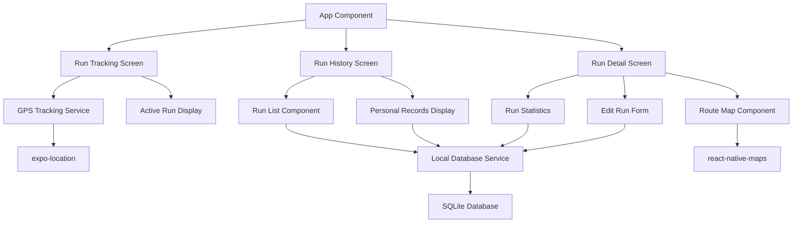

# Components

## GPS Tracking Service

**Responsibility:** Manages real-time GPS location tracking during runs, handling location permissions, tracking state, and coordinate collection

**Key Interfaces:**
- `startTracking()` - Begin GPS tracking with proper permissions
- `stopTracking()` - End GPS tracking and return route data
- `pauseTracking()` - Temporarily pause location collection
- `getCurrentLocation()` - Get single location point

**Dependencies:** expo-location, device location services

**Technology Stack:** expo-location 16.0+, React hooks for state management

## Local Database Service

**Responsibility:** Manages all SQLite database operations including schema creation, run data persistence, and personal records calculation

**Key Interfaces:**
- `saveRun(run: Run)` - Persist completed run data
- `getAllRuns()` - Retrieve run history sorted by date
- `getPersonalRecords()` - Calculate and return current PRs
- `updateRun(id: string, updates: Partial<Run>)` - Edit run details

**Dependencies:** expo-sqlite

**Technology Stack:** expo-sqlite 11.0+, TypeScript interfaces for type safety

## Route Visualization Component

**Responsibility:** Displays completed run routes on interactive maps with route polylines and performance metrics overlay

**Key Interfaces:**
- `<RouteMap route={GPSPoint[]} />` - Display route on map
- `<RunSummary run={Run} />` - Show run statistics
- Route zoom and pan controls

**Dependencies:** react-native-maps, GPS data from tracking service

**Technology Stack:** react-native-maps 1.7+, React Native components

## Run History Manager

**Responsibility:** Manages display of historical runs, personal records, and run editing functionality

**Key Interfaces:**
- `<RunList runs={Run[]} />` - Display run history list
- `<RunDetail run={Run} />` - Show individual run details
- `<EditRun run={Run} />` - Edit run metadata

**Dependencies:** Local Database Service

**Technology Stack:** React Native components, React Navigation for detail screens

## Component Diagrams

