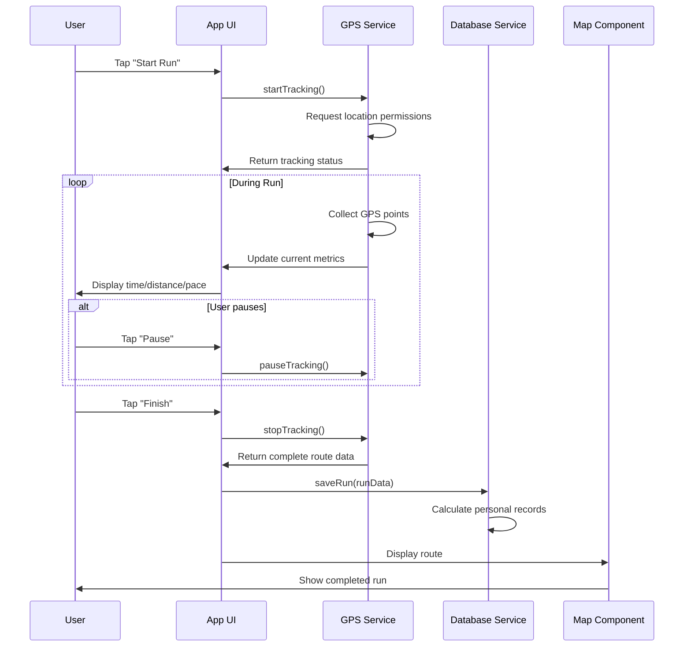
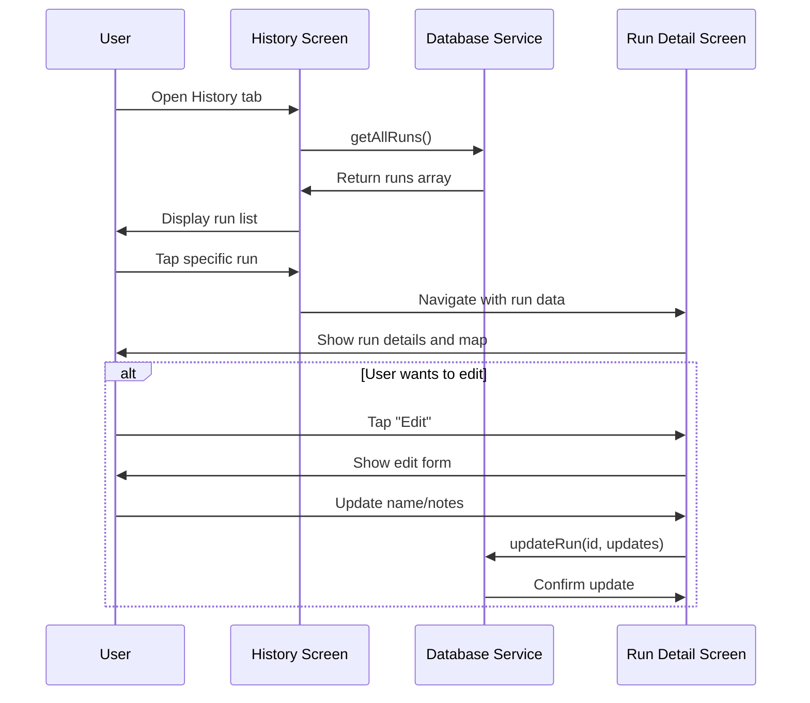

# Core Workflows

## Run Tracking Workflow

```mermaid
sequenceDiagram
    participant U as User
    participant UI as App UI
    participant GPS as GPS Service
    participant DB as Database Service
    participant Map as Map Component

    U->>UI: Tap "Start Run"
    UI->>GPS: startTracking()
    GPS->>GPS: Request location permissions
    GPS->>UI: Return tracking status

    loop During Run
        GPS->>GPS: Collect GPS points
        GPS->>UI: Update current metrics
        UI->>U: Display time/distance/pace

        alt User pauses
            U->>UI: Tap "Pause"
            UI->>GPS: pauseTracking()
        end
    end

    U->>UI: Tap "Finish"
    UI->>GPS: stopTracking()
    GPS->>UI: Return complete route data
    UI->>DB: saveRun(runData)
    DB->>DB: Calculate personal records
    UI->>Map: Display route
    Map->>U: Show completed run
```

## Run History Workflow

```mermaid
sequenceDiagram
    participant U as User
    participant UI as History Screen
    participant DB as Database Service
    participant Detail as Run Detail Screen

    U->>UI: Open History tab
    UI->>DB: getAllRuns()
    DB->>UI: Return runs array
    UI->>U: Display run list

    U->>UI: Tap specific run
    UI->>Detail: Navigate with run data
    Detail->>U: Show run details and map

    alt User wants to edit
        U->>Detail: Tap "Edit"
        Detail->>U: Show edit form
        U->>Detail: Update name/notes
        Detail->>DB: updateRun(id, updates)
        DB->>Detail: Confirm update
    end
```
