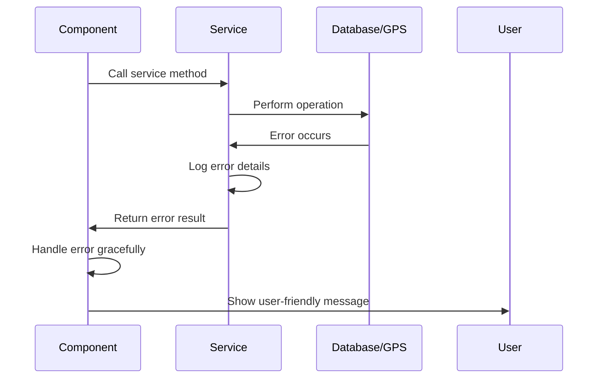

# Error Handling Strategy

## Error Flow



## Error Response Format

```typescript
interface ServiceResult<T> {
  success: boolean;
  data?: T;
  error?: {
    code: string;
    message: string;
    details?: Record<string, any>;
  };
}
```

## Frontend Error Handling

```typescript
// Service-level error handling
export const gpsService = {
  async startTracking(): Promise<ServiceResult<boolean>> {
    try {
      const { status } = await Location.requestForegroundPermissionsAsync();
      if (status !== 'granted') {
        return {
          success: false,
          error: {
            code: 'PERMISSION_DENIED',
            message: 'Location permission is required to track runs'
          }
        };
      }

      // Start tracking logic...
      return { success: true, data: true };
    } catch (error) {
      return {
        success: false,
        error: {
          code: 'GPS_ERROR',
          message: 'Failed to start GPS tracking',
          details: { originalError: error.message }
        }
      };
    }
  }
};

// Component-level error handling
const TrackingScreen = () => {
  const [error, setError] = useState<string | null>(null);

  const handleStartTracking = async () => {
    const result = await gpsService.startTracking();
    if (!result.success) {
      setError(result.error?.message || 'Unknown error occurred');
      return;
    }
    // Continue with success flow...
  };

  return (
    <View>
      {error && <ErrorBanner message={error} onDismiss={() => setError(null)} />}
      {/* Rest of component */}
    </View>
  );
};
```

## Backend Error Handling

```typescript
// Database service error handling
export class DatabaseService {
  async saveRun(run: Run): Promise<ServiceResult<void>> {
    try {
      // Validate run data
      if (!run.id || !run.startTime || !run.endTime) {
        return {
          success: false,
          error: {
            code: 'INVALID_DATA',
            message: 'Run data is incomplete'
          }
        };
      }

      // Save to database...
      return { success: true };
    } catch (error) {
      console.error('Database save error:', error);
      return {
        success: false,
        error: {
          code: 'DATABASE_ERROR',
          message: 'Failed to save run data',
          details: { error: error.message }
        }
      };
    }
  }
}
```
