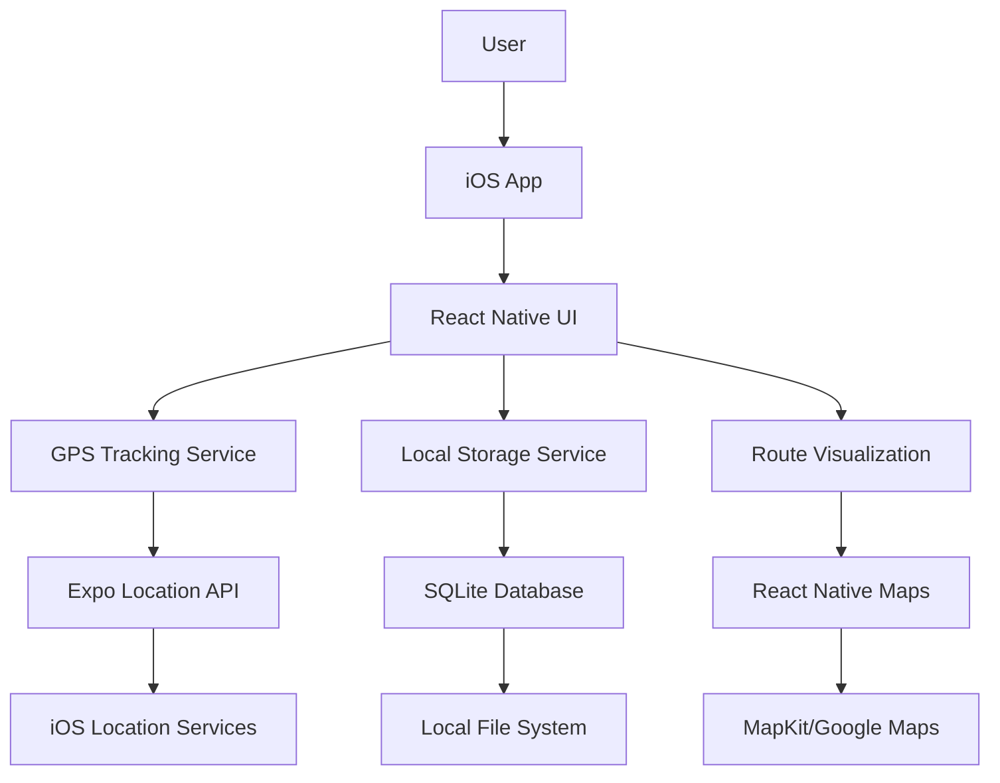

# High Level Architecture

## Technical Summary

Personal Running Tracker uses a **local-first mobile architecture** built on Expo managed workflow with React Native and TypeScript. The app employs **SQLite for local data persistence**, **Expo Location for GPS tracking**, and **React Native Maps for route visualization**. All data remains on-device with no backend services or cloud dependencies. The architecture prioritizes **simplicity, privacy, and offline functionality** through a streamlined component structure that delivers core running tracking features without external integrations.

## Platform and Infrastructure Choice

**Platform:** Local iOS Device (No Cloud Infrastructure)
**Key Services:**
- Expo managed workflow for development and deployment
- iOS Location Services for GPS tracking
- Local SQLite database for data persistence
- Apple App Store for distribution

**Deployment Host and Regions:** Local device only - no remote hosting required

## Repository Structure

**Structure:** Single repository (Monorepo not needed for single mobile app)
**Monorepo Tool:** N/A - Single Expo project structure
**Package Organization:** Standard Expo project with clean component organization by feature/screen

## High Level Architecture Diagram

## Architectural Patterns

- **Local-First Architecture:** All data stored and processed locally on device - _Rationale:_ Privacy-first approach eliminates cloud dependencies and ensures data ownership
- **Component-Based UI:** Reusable React Native components with TypeScript - _Rationale:_ Maintainability and type safety for mobile development
- **Service Layer Pattern:** Abstracted data access and GPS tracking logic - _Rationale:_ Separation of concerns and testability
- **Event-Driven State Management:** React hooks and context for state management - _Rationale:_ Simple state management appropriate for single-user local app
- **Repository Pattern:** Abstract SQLite database operations - _Rationale:_ Enables testing and potential future database changes
